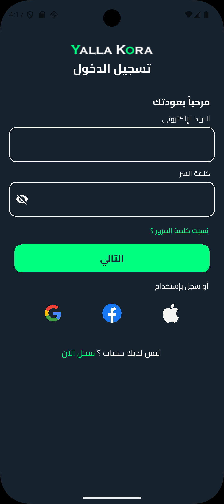
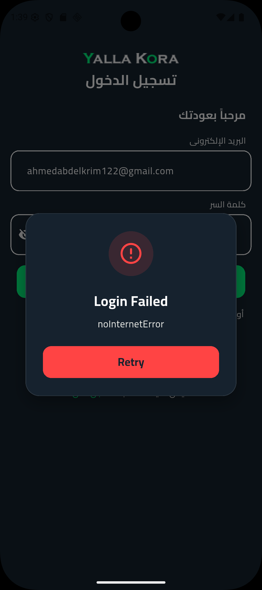
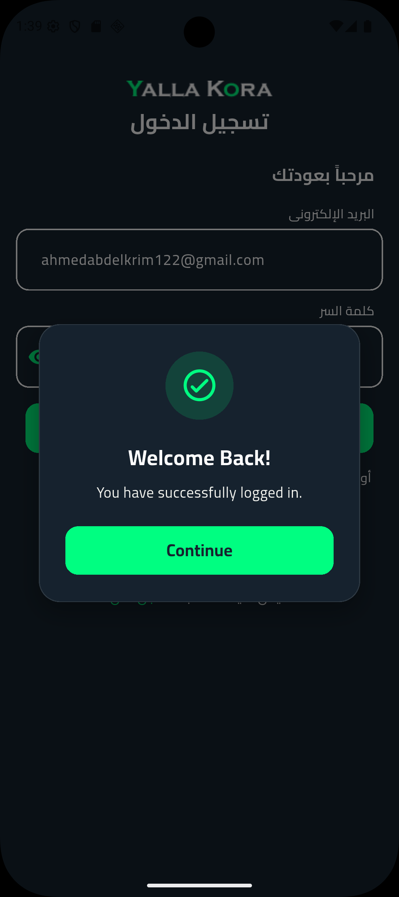

# Yalla Kora - Football App



Yalla Kora is a Flutter-based mobile application for football enthusiasts. The app provides a sleek and modern interface for users to engage with football content, manage their accounts, and connect through social authentication.

## 🚀 Features

- **User Authentication**: Secure login functionality with email/password
- **Social Login**: Integration with Google, Facebook, and Apple for easy sign-in
- **Responsive Design**: Adapts to various screen sizes using flutter_screenutil
- **Modern UI**: Clean and intuitive user interface with custom themes
- **Multi-language Support**: Easy localization with easy_localization package

## 📸 Screenshots

<div style="display: flex; gap: 10px;">
  <div>
    
  </div>
  <div>
    
  </div>
</div>

## 🏗️ Architecture

The project follows a modular architecture with a clear separation of concerns:

```
lib/
├── core/
│   ├── constants/       # App-wide constants (colors, images, etc.)
│   ├── helper/          # Utility functions and extensions
│   ├── routing/         # App routing and navigation
│   ├── theme/           # App theme and text styles
│   └── widgets/         # Reusable custom widgets
└── features/
    └── login/          # Login feature module
        ├── data/       # Data models and repositories
        ├── logic/      # Business logic (BLoC/Cubit)
        └── ui/         # User interface components
            └── widgets/ # Login-specific widgets
```

## 🔧 Workflow

1. **App Initialization**
   - The app starts with [main.dart](file:///d:/All_Flutter_Projects/yalla_kora/lib/main.dart) which initializes the [YallaKora](file:///d:/All_Flutter_Projects/yalla_kora/lib/yalla_kora.dart#L6-L26) widget
   - [YallaKora](file:///d:/All_Flutter_Projects/yalla_kora/lib/yalla_kora.dart#L6-L26) configures the MaterialApp with routing and theme

2. **Routing**
   - Initial route is set to `/loginScreen`
   - [AppRouter](file:///d:/All_Flutter_Projects/yalla_kora/lib/core/routing/app_router.dart#L6-L29) handles navigation between screens

3. **Login Flow**
   - User lands on [LoginScreen](file:///d:/All_Flutter_Projects/yalla_kora/lib/features/login/ui/login_screen.dart#L11-L52)
   - [LoginHeader](file:///d:/All_Flutter_Projects/yalla_kora/lib/features/login/ui/widgets/login_form.dart#L6-L24) displays the app logo and title
   - [LoginForm](file:///d:/All_Flutter_Projects/yalla_kora/lib/features/login/ui/widgets/login_header.dart#L9-L14) handles email/password input with validation
   - Social login options are provided via [SocialLoginAuthRow](file:///d:/All_Flutter_Projects/yalla_kora/lib/features/login/ui/widgets/social_login_auth_row.dart#L6-L43)
   - "Not Have Account" option redirects to registration

4. **Validation**
   - Email and password fields are validated using custom validators
   - Error handling for invalid inputs

5. **Authentication**
   - Credentials are processed (integration points for backend services)
   - Successful login navigates to the main app content

## 📦 Dependencies

Key packages used in this project:

- `flutter_screenutil` - Responsive UI scaling
- `flutter_svg` - SVG image rendering
- `flutter_bloc` - State management
- `easy_localization` - Multi-language support
- `dio` - HTTP client for API requests
- `get_it` - Dependency injection
- `json_annotation`/`freezed` - Data serialization

## 🛠️ Getting Started

### Prerequisites

- Flutter SDK (version 3.8.0 or higher)
- Dart SDK
- Android Studio or VS Code with Flutter extensions

### Installation

1. Clone the repository:
   ```bash
   git clone <repository-url>
   ```

2. Navigate to the project directory:
   ```bash
   cd yalla_kora
   ```

3. Install dependencies:
   ```bash
   flutter pub get
   ```

4. Run the app:
   ```bash
   flutter run
   ```

## 📱 Supported Platforms

- Android
- iOS
- Web
- Windows
- macOS
- Linux

## 🎨 UI Components

The app uses a consistent design system with:

- Custom color palette defined in [AppColors](file:///d:/All_Flutter_Projects/yalla_kora/lib/core/constants/app_colors.dart#L1-L11)
- Typography system in [TextStyles](file:///d:/All_Flutter_Projects/yalla_kora/lib/core/theme/text_styles.dart#L3-L35)
- Reusable widgets like [AppButton](file:///d:/All_Flutter_Projects/yalla_kora/lib/core/widgets/app_button.dart#L5-L45) and [AppFormField](file:///d:/All_Flutter_Projects/yalla_kora/lib/core/widgets/app_form_field.dart#L5-L47)

## 🌐 Localization

The app supports multi-language functionality through the `easy_localization` package. Translation files can be added to support additional languages.

## 🤝 Contributing

Contributions are welcome! Please feel free to submit a Pull Request.

## 📄 License

This project is licensed under the MIT License - see the LICENSE file for details.