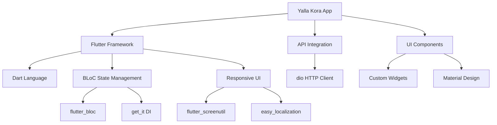
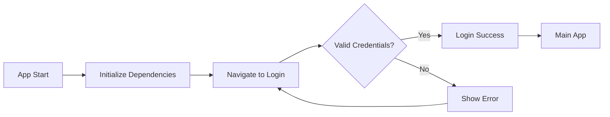

<!-- Improved README Banner -->
<div align="center">
  
  
  <h1>Yalla Kora ⚽</h1>
  
  <p>
    <strong>A modern Flutter application for football enthusiasts</strong>
  </p>
  
  <p>
    <a href="https://github.com/ahmedabdelkrim125/YALLA-KORA/stargazers">
      
    </a>
    <a href="https://github.com/ahmedabdelkrim125/YALLA-KORA/network/members">
      
    </a>
    <a href="https://github.com/ahmedabdelkrim125/YALLA-KORA/issues">
      
    </a>
    <a href="https://github.com/ahmedabdelkrim125/YALLA-KORA/blob/main/LICENSE">
      
    </a>
  </p>
  
  <p>
    <a href="#-screenshots">📸 Screenshots</a> •
    <a href="#-features">🚀 Features</a> •
    <a href="#-tech-stack">💻 Tech Stack</a> •
    <a href="#-getting-started">🛠️ Getting Started</a> •
    <a href="#-contributing">🤝 Contributing</a>
  </p>
</div>

---

## 📖 About

**Yalla Kora** is a cutting-edge Flutter application designed for football fans who want to stay connected with the beautiful game. Built with a modern tech stack and following best practices, this app delivers a seamless experience for users to engage with football content, manage their accounts, and connect through social authentication.

## 🚀 Features

| Feature | Description |
|--------|-------------|
| **🔐 Secure Authentication** | Email/password login with robust validation |
| **👥 Social Login** | One-tap sign in with Google, Facebook, and Apple |
| **📱 Responsive Design** | Perfectly adapts to all device sizes |
| **🎨 Modern UI** | Sleek, intuitive interface with custom themes |
| **🌍 Multi-language** | Internationalization support for global reach |
| **🔄 State Management** | Efficient BLoC pattern implementation |
| **📡 API Integration** | Seamless communication with backend services |

## 📸 Screenshots

<div style="display: flex; justify-content: center; gap: 20px; margin: 20px 0;">
  <div style="text-align: center;">
    
    <p>Login Success</p>
  </div>
  <div style="text-align: center;">
    
    <p>Login Failure</p>
  </div>
</div>

## 💻 Tech Stack

This project leverages industry-leading technologies:



### Core Libraries

- **State Management**: [`flutter_bloc`](https://pub.dev/packages/flutter_bloc) - Predictable state management
- **Dependency Injection**: [`get_it`](https://pub.dev/packages/get_it) - Simple service locator
- **Responsive UI**: [`flutter_screenutil`](https://pub.dev/packages/flutter_screenutil) - Adaptive screen sizing
- **Localization**: [`easy_localization`](https://pub.dev/packages/easy_localization) - Multi-language support
- **Networking**: [`dio`](https://pub.dev/packages/dio) - Powerful HTTP client
- **Data Serialization**: [`freezed`](https://pub.dev/packages/freezed) + [`json_annotation`](https://pub.dev/packages/json_annotation)

## 🏗️ Architecture

The project follows a clean, modular architecture:

```
lib/
├── core/                     # Shared utilities
│   ├── constants/            # App-wide constants
│   ├── di/                   # Dependency injection
│   ├── helper/               # Utility functions
│   ├── networking/           # API services
│   ├── routing/              # App navigation
│   ├── theme/                # App styling
│   └── widgets/              # Reusable components
└── features/                 # Feature modules
    ├── login/                # Authentication
    │   ├── data/             # Models & repositories
    │   ├── logic/            # Business logic
    │   └── ui/               # Screens & widgets
    ├── signup/               # Registration
    └── home/                 # Main application
```

## 🔧 Workflow



1. **App Initialization**
   - Entry point at [main.dart](file:///d:/All_Flutter_Projects/yalla_kora/lib/main.dart)
   - Initializes [YallaKora](file:///d:/All_Flutter_Projects/yalla_kora/lib/yalla_kora.dart#L6-L26) widget with routing and theme

2. **Authentication Flow**
   - Users land on [LoginScreen](file:///d:/All_Flutter_Projects/yalla_kora/lib/features/login/ui/login_screen.dart#L11-L52)
   - Form validation with [AppValidator](file:///d:/All_Flutter_Projects/yalla_kora/lib/core/helper/validation.dart#L3-L21)
   - State managed by [LoginCubit](file:///d:/All_Flutter_Projects/yalla_kora/lib/features/login/logic/login_cubit/login_cubit.dart#L13-L46)
   - API calls handled by [Dio](file:///d:/All_Flutter_Projects/yalla_kora/lib/core/networking/dio_factory.dart#L10-L34)

3. **Navigation**
   - Managed by [AppRouter](file:///d:/All_Flutter_Projects/yalla_kora/lib/core/routing/app_router.dart#L6-L29)
   - Routes defined in [Routes](file:///d:/All_Flutter_Projects/yalla_kora/lib/core/routing/routes.dart#L1-L5)

## 🛠️ Getting Started

### Prerequisites

- Flutter SDK 3.8.0 or higher
- Dart SDK
- Android Studio or VS Code with Flutter extensions

### Installation

1. Clone the repository:
   ```bash
   git clone https://github.com/ahmedabdelkrim125/YALLA-KORA.git
   ```

2. Navigate to project directory:
   ```bash
   cd yalla_kora
   ```

3. Install dependencies:
   ```bash
   flutter pub get
   ```

4. Run the app:
   ```bash
   flutter run
   ```

### Code Generation

This project uses code generation. To generate necessary files:

```bash
dart run build_runner build --delete-conflicting-outputs
```

## 📱 Supported Platforms

✅ Android • ✅ iOS • ✅ Web • ✅ Windows • ✅ macOS • ✅ Linux

## 🎨 UI Highlights

- Custom color palette in [AppColors](file:///d:/All_Flutter_Projects/yalla_kora/lib/core/theme/app_colors.dart#L1-L11)
- Typography system in [TextStyles](file:///d:/All_Flutter_Projects/yalla_kora/lib/core/theme/text_styles.dart#L3-L35)
- Reusable components:
  - [AppButton](file:///d:/All_Flutter_Projects/yalla_kora/lib/core/widgets/app_button.dart#L5-L45) - Custom button widget
  - [AppFormField](file:///d:/All_Flutter_Projects/yalla_kora/lib/core/widgets/app_form_field.dart#L5-L47) - Form input field
  - [ModernDialogHelper](file:///d:/All_Flutter_Projects/yalla_kora/lib/core/widgets/modern_dialog_helper.dart#L5-L44) - Styled dialogs

## 🌐 Localization

The app supports multi-language functionality through `easy_localization`. Translation files can be found in the assets directory.

To add a new language:
1. Create a new JSON file in `assets/translations/`
2. Add translations following the existing format
3. Register the new locale in [main.dart](file:///d:/All_Flutter_Projects/yalla_kora/lib/main.dart)

## 🧪 Testing

Run unit and widget tests:

```bash
flutter test
```

## 🤝 Contributing

Contributions are welcome! Here's how you can contribute:

1. Fork the repository
2. Create a feature branch (`git checkout -b feature/AmazingFeature`)
3. Commit your changes (`git commit -m 'Add some AmazingFeature'`)
4. Push to the branch (`git push origin feature/AmazingFeature`)
5. Open a pull request

### Code Style

This project follows the official [Dart style guide](https://dart.dev/guides/language/effective-dart/style) and uses [flutter_lints](https://pub.dev/packages/flutter_lints) for static analysis.

## 📄 License

This project is licensed under the MIT License - see the [LICENSE](LICENSE) file for details.

## 👥 Authors

- **Ahmed Abdelkrim** - *Lead Developer* - [ahmedabdelkrim125](https://github.com/ahmedabdelkrim125)

## 🙏 Acknowledgments

- Thanks to all contributors who have helped shape this project
- Inspired by the passion of football fans worldwide
- Built with ❤️ using Flutter

---
<div align="center">
  <sub>Built with ❤️ using Flutter | ⚽ Yalla Kora - Where Football Fans Unite</sub>
</div>